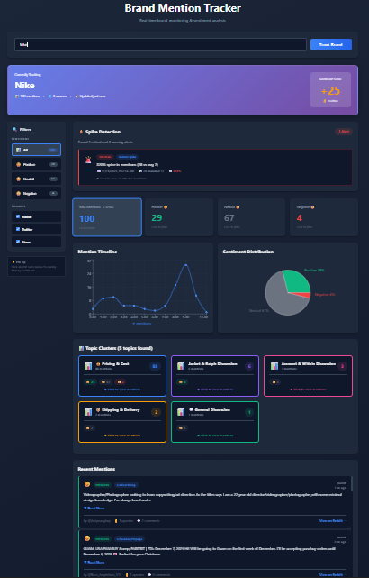
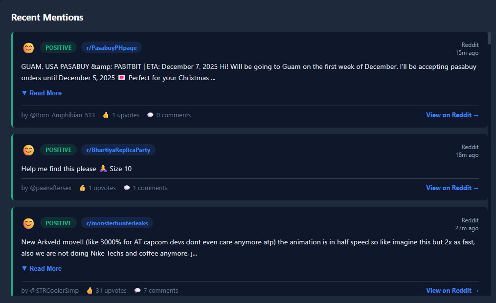
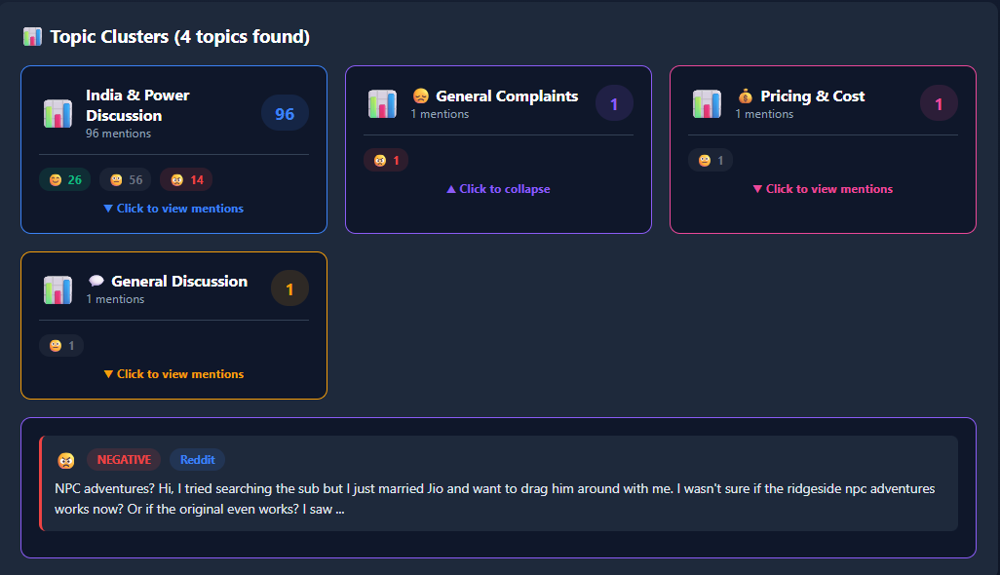
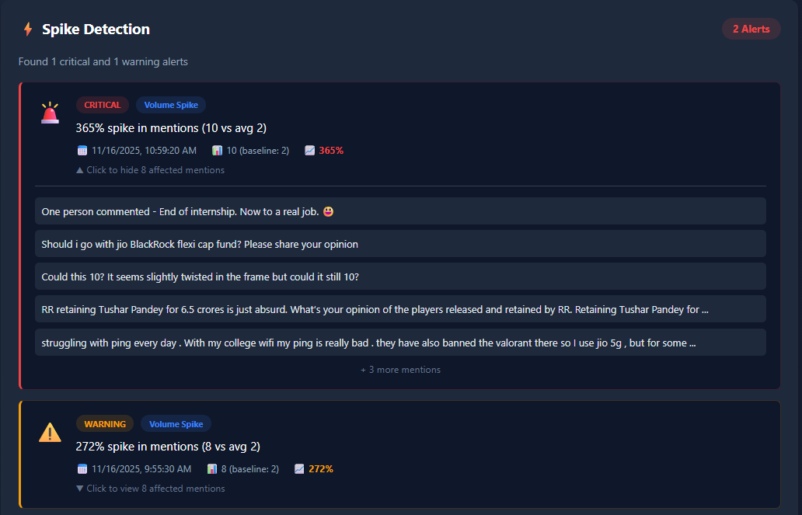
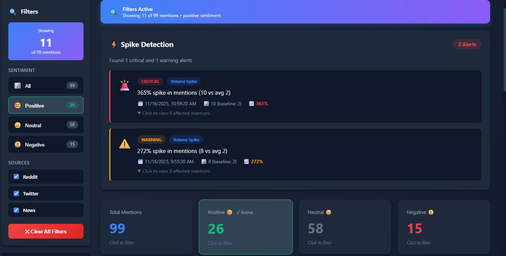

# 🎯 Brand Mention & Reputation Tracker

> Real-time brand monitoring platform with AI-powered sentiment analysis and multi-source aggregation


## 📋 Table of Contents

- [Overview](#overview)
- [Features](#features)
- [Tech Stack](#tech-stack)
- [Architecture](#architecture)
- [Installation](#installation)
- [Configuration](#configuration)
- [Usage](#usage)
- [API Documentation](#api-documentation)
- [Screenshots](#screenshots)
- [Hackathon Challenge](#hackathon-challenge)
- [Future Enhancements](#future-enhancements)
- [Contributing](#contributing)
- [License](#license)

## 🌟 Overview

Brand Mention & Reputation Tracker is a comprehensive web application designed to help marketing teams monitor their brand's online presence in real-time. The platform aggregates mentions from multiple sources (Reddit, Twitter, News), analyzes sentiment using AI, detects conversation spikes, and provides actionable insights through an intuitive dashboard.

### Problem Statement

Marketers struggle to stay ahead of conversations happening across social media, blogs, forums, and news outlets. Important brand mentions often go unnoticed, especially when they're negative or trending quickly. This results in missed opportunities and delayed responses.

### Solution

Our platform provides:
- **Real-time Aggregation**: Automatically pulls mentions from Reddit, Twitter, and news sources
- **AI Sentiment Analysis**: Uses advanced NLP models to categorize mentions as positive, neutral, or negative
- **Multi-language Support**: Automatically detects and translates non-English content
- **Spike Detection**: Identifies unusual patterns in volume and sentiment
- **Topic Clustering**: Groups mentions into meaningful categories using machine learning
- **Interactive Dashboard**: Beautiful, responsive UI for quick insights and decision-making

## ✨ Features

### Core Features (Implemented ✅)

#### 1. Multi-Source Data Aggregation
- **Reddit API Integration**: Real-time subreddit and post monitoring
- **Twitter API v2**: Recent tweets and trending mentions
- **News API**: Latest news articles from global sources
- **Unified Data Pipeline**: Consistent data structure across all sources

#### 2. AI-Powered Sentiment Analysis
- **Translation Service**: Automatic language detection and translation to English
- **Advanced NLP**: Sentiment classification (positive/neutral/negative)
- **Contextual Analysis**: Understanding beyond simple keyword matching
- **Confidence Scoring**: Reliability metrics for each analysis

#### 3. Topic Clustering & Classification
- **Machine Learning**: K-means clustering with TF-IDF vectorization
- **Smart Labeling**: Pattern-based topic identification
  - Pricing & Cost discussions
  - Customer Support mentions
  - Product Quality feedback
  - Technical Issues
  - Feature Requests
  - And more...
- **Visual Organization**: Color-coded clusters with expandable details

#### 4. Conversation Spike Detection
- **Volume Spike Alerts**: Identifies unusual increases in mention frequency
- **Sentiment Shift Detection**: Alerts for sudden changes in sentiment
- **Trending Topics**: Discovers emerging keywords and themes
- **Severity Levels**: Critical, Warning, and Info classifications
- **Historical Comparison**: Baseline tracking for anomaly detection

#### 5. Real-time Monitoring Dashboard
- **Live Updates**: Fresh data on every search
- **Interactive Charts**: 
  - Timeline visualization (Recharts)
  - Sentiment distribution pie chart
  - Hourly mention trends
- **Responsive Design**: Works seamlessly on desktop and tablet
- **Dark Theme**: Easy on the eyes for extended monitoring

#### 6. Advanced Filtering & Search
- **Sentiment Filters**: View positive, neutral, or negative mentions
- **Source Filters**: Toggle Reddit, Twitter, and News sources
- **Real-time Updates**: Instant filtering without page reload
- **Active Filter Indicators**: Clear visual feedback

### User Experience Features

- **Loading Skeletons**: Smooth loading experience
- **Empty States**: Helpful guidance when no results found
- **Error Handling**: Graceful fallbacks for API failures
- **Expandable Content**: Read more/less for long mentions
- **Direct Links**: One-click access to original posts/articles
- **Translation Badges**: Visual indicators for translated content

## 🛠️ Tech Stack

### Frontend
- **React 18.x** with Hooks (useState, useEffect)
- **Vite** - Lightning-fast build tool and dev server
- **Recharts** - Data visualization library
- **Axios** - HTTP client for API requests
- **Modern CSS** - Gradient designs, animations, responsive layouts

### Backend
- **Node.js 20.x** - JavaScript runtime
- **Express.js** - Web application framework
- **MVC Architecture** - Organized code structure
  - Controllers: Request handling
  - Services: Business logic
  - Routes: API endpoints
  - Utils: Reusable utilities

### APIs & AI
- **Reddit API** - Social media mentions
- **Twitter API v2** - Real-time tweets
- **News API** - Global news coverage
- **Google Translate API** - Multi-language support
- **Natural** - NLP library for text processing
- **Franc** - Language detection
- **ML-KMeans** - Clustering algorithm

### Development Tools
- **Git & GitHub** - Version control
- **npm** - Package management
- **ESLint** - Code quality
- **Prettier** - Code formatting

## 🏗️ Architecture
```
┌─────────────────────────────────────────────────────────────┐
│                        Frontend (React)                      │
│  ┌─────────────┐  ┌──────────────┐  ┌──────────────────┐   │
│  │ Components  │  │   Services   │  │      Utils       │   │
│  │   (UI)      │  │ (API Calls)  │  │   (Helpers)      │   │
│  └─────────────┘  └──────────────┘  └──────────────────┘   │
└─────────────────────────┬───────────────────────────────────┘
                          │ HTTP/REST
┌─────────────────────────▼───────────────────────────────────┐
│                    Backend (Node.js/Express)                 │
│  ┌─────────────┐  ┌──────────────┐  ┌──────────────────┐   │
│  │ Controllers │  │   Services   │  │   Routes/API     │   │
│  └─────────────┘  └──────────────┘  └──────────────────┘   │
└─────────────────────────┬───────────────────────────────────┘
                          │ External APIs
┌─────────────────────────▼───────────────────────────────────┐
│               External Services & APIs                       │
│  ┌────────┐  ┌─────────┐  ┌──────────┐  ┌───────────────┐  │
│  │ Reddit │  │ Twitter │  │ News API │  │ Translation   │  │
│  └────────┘  └─────────┘  └──────────┘  └───────────────┘  │
└─────────────────────────────────────────────────────────────┘
```

### Data Flow

1. **User Input** → Brand name entered in search bar
2. **API Aggregation** → Parallel requests to Reddit, Twitter, News APIs
3. **Translation** → Non-English content translated to English
4. **Sentiment Analysis** → AI classification of each mention
5. **Topic Clustering** → ML-based grouping of similar mentions
6. **Spike Detection** → Statistical analysis for anomalies
7. **Dashboard Rendering** → Real-time visualization of insights

## 🚀 Installation

### Prerequisites

- Node.js (v20 or higher)
- npm (v10 or higher)
- Git

### Step 1: Clone the Repository
```bash
git clone https://github.com/aarav0012/brand-tracker.git
cd brand-tracker
```

### Step 2: Backend Setup
```bash
cd brand-tracker-backend
npm install

# Create .env file
cat > .env << EOL
PORT=5000
TWITTER_BEARER_TOKEN=your_twitter_token_here
NEWS_API_KEY=your_news_api_key_here
HUGGINGFACE_API_KEY=your_huggingface_key_here
CORS_ORIGIN=http://localhost:5173
EOL

# Start backend server
node server.js
```

Backend will run on `http://localhost:5000`

### Step 3: Frontend Setup
```bash
# Open new terminal
cd brand-tracker-vite
npm install

# Start development server
npm run dev
```

Frontend will run on `http://localhost:5173`

### Step 4: Open Browser

Navigate to `http://localhost:5173` and start tracking brands!

## 🔑 Configuration

### Obtaining API Keys

#### 1. Twitter API (Required)
1. Visit [Twitter Developer Portal](https://developer.twitter.com/)
2. Create a new project and app
3. Navigate to "Keys and Tokens"
4. Generate Bearer Token
5. Copy and paste into `.env`

#### 2. News API (Required)
1. Visit [NewsAPI.org](https://newsapi.org/)
2. Sign up for free account
3. Copy your API key
4. Paste into `.env`

#### 3. Hugging Face API (Optional - for enhanced sentiment)
1. Visit [Hugging Face](https://huggingface.co/)
2. Create account and go to Settings → Access Tokens
3. Generate new token
4. Paste into `.env`

**Note:** Reddit API doesn't require authentication for basic search functionality.

### Environment Variables
```env
# Backend Configuration
PORT=5000                                    # Backend server port
CORS_ORIGIN=http://localhost:5173           # Frontend URL

# API Keys
TWITTER_BEARER_TOKEN=your_token             # Twitter API access
NEWS_API_KEY=your_key                       # News API access
HUGGINGFACE_API_KEY=your_key               # Optional: Enhanced AI
```

## 📖 Usage

### Basic Workflow

1. **Enter Brand Name**: Type any brand name in the search bar
2. **Click "Track Brand"**: Initiates data collection from all sources
3. **View Dashboard**: Real-time insights load in seconds
4. **Apply Filters**: 
   - Click sentiment cards (Positive/Neutral/Negative)
   - Toggle sources (Reddit/Twitter/News)
   - Use sidebar filters
5. **Explore Details**:
   - Click on topic clusters to expand
   - Click spike alerts to view affected mentions
   - Click "Read More" on mentions for full content
6. **Take Action**: Use "View on Reddit/Twitter" links to respond

### Example Searches

Try these popular brands:
- `Apple` - Tech giant with active community
- `Nike` - Sports brand with strong social presence
- `Tesla` - Highly discussed automotive company
- `Starbucks` - Consumer brand with lots of feedback
- `McDonald's` - Fast food with varied sentiment

## 📡 API Documentation

### Backend Endpoints

#### Reddit Search
```http
GET /api/reddit/search?query=Nike&limit=50
```

#### Twitter Search
```http
GET /api/twitter/search?query=Nike&max_results=50
```

#### News Search
```http
GET /api/news/search?query=Nike&pageSize=50
```

#### Sentiment Analysis
```http
POST /api/analysis/analyze-mentions
Content-Type: application/json

{
  "mentions": [...]
}
```

#### Topic Clustering
```http
POST /api/topics/cluster
Content-Type: application/json

{
  "mentions": [...]
}
```

#### Spike Detection
```http
POST /api/spikes/detect
Content-Type: application/json

{
  "mentions": [...]
}
```

### Response Format

All endpoints return JSON with consistent structure:
```json
{
  "id": "unique_id",
  "text": "mention content",
  "source": "Reddit|Twitter|News",
  "sentiment": "positive|neutral|negative",
  "timestamp": "2025-11-16T...",
  "author": "username",
  "url": "direct_link"
}
```

## 📸 Screenshots

### Dashboard Overview

*Main dashboard showing real-time brand monitoring*

### Sentiment Analysis

*AI-powered sentiment breakdown with charts*

### Topic Clusters

*Machine learning-based topic grouping*

### Spike Detection

*Real-time alerts for unusual activity*

### Filters & Search

*Advanced filtering options*

## 🏆 Hackathon Challenge

This project was built for the **RapidQuest Hackathon 2024** - Brand Mention & Reputation Tracker Challenge.

### Challenge Requirements Met

✅ **Aggregation of mentions from various public data sources**
- Reddit API integration
- Twitter API v2 integration
- News API integration
- Unified data pipeline

✅ **Sentiment analysis (positive / negative / neutral)**
- AI-powered classification
- Multi-language support
- Contextual understanding

✅ **Topic or theme clustering**
- K-means machine learning algorithm
- Pattern-based smart labeling
- Visual organization

✅ **Alerts for conversation spikes**
- Volume spike detection
- Sentiment shift alerts
- Trending topic identification
- Critical/Warning severity levels

✅ **Real-time monitoring dashboard**
- Interactive charts and visualizations
- Live filtering and search
- Responsive design
- Professional UI/UX

### Tech Stack Highlights

- **Modern Frontend**: React 18 with Vite for blazing-fast development
- **Robust Backend**: Node.js with MVC architecture
- **AI Integration**: Multiple NLP services for accuracy
- **Professional Design**: Dark theme with gradients and animations
- **Scalable Architecture**: Clean separation of concerns

## 🔮 Future Enhancements

### Short-term Improvements
- [ ] Email/SMS notifications for critical alerts
- [ ] Export reports to PDF/Excel
- [ ] User authentication and saved searches
- [ ] Historical data storage (PostgreSQL/MongoDB)
- [ ] Comparative brand analysis
- [ ] Custom alert thresholds

### Long-term Vision
- [ ] Mobile app (React Native)
- [ ] Slack/Discord integration
- [ ] Competitive benchmarking dashboard
- [ ] Predictive analytics using ML
- [ ] Automated response suggestions
- [ ] Multi-brand monitoring
- [ ] Custom sentiment training
- [ ] API rate limiting and caching
- [ ] WebSocket for real-time updates
- [ ] Advanced analytics with BigQuery

## 🚀 Live Demo

**Frontend**: https://brand-tracker-topaz.vercel.app
**Backend API**: https://brand-tracker-12yt.onrender.com


## 🤝 Contributing

Contributions are welcome! Please feel free to submit a Pull Request.

1. Fork the repository
2. Create your feature branch (`git checkout -b feature/AmazingFeature`)
3. Commit your changes (`git commit -m 'Add some AmazingFeature'`)
4. Push to the branch (`git push origin feature/AmazingFeature`)
5. Open a Pull Request

## 📄 License

This project is licensed under the MIT License - see the [LICENSE](LICENSE) file for details.

## 👨‍💻 Author

**[Aarav Jain]**
- GitHub: [@aarav0012](https://github.com/aarav0012)
- LinkedIn: [Aarav Jain](https://www.linkedin.com/in/aarav-jain-094a77258/)
- Email: jainaarav364@gmail.com

## 🙏 Acknowledgments

- **RapidQuest** for organizing the hackathon
- **Hugging Face** for AI models
- **Reddit, Twitter, News API** for data access
- **Open source community** for amazing libraries

## 📞 Support

For issues, questions, or suggestions:
- Open an issue on GitHub
---

<div align="center">

**Built with ❤️ for RapidQuest Hackathon 2024**

⭐ Star this repo if you find it helpful!

</div>
